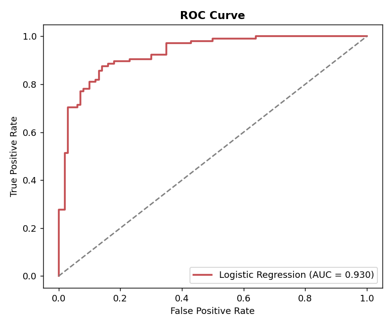
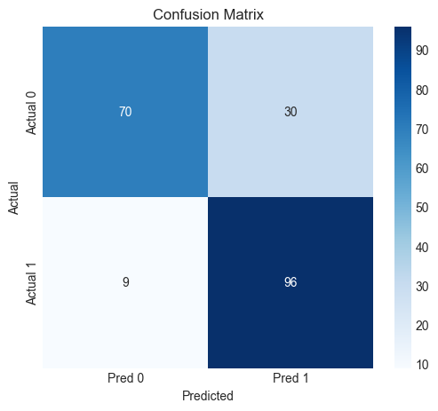
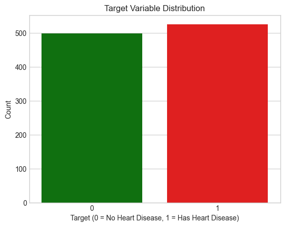
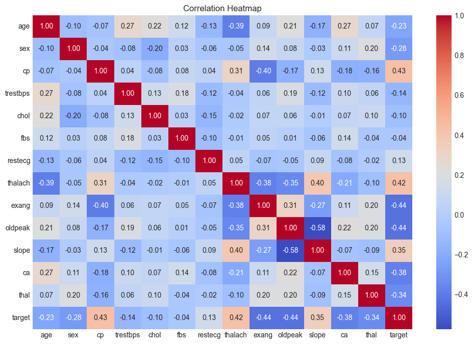
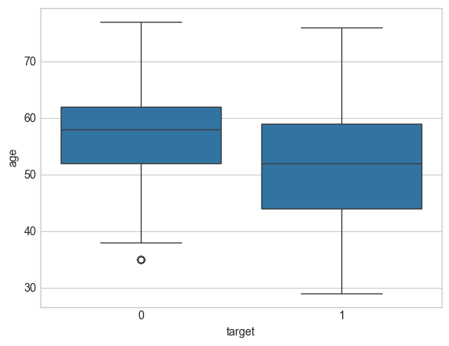
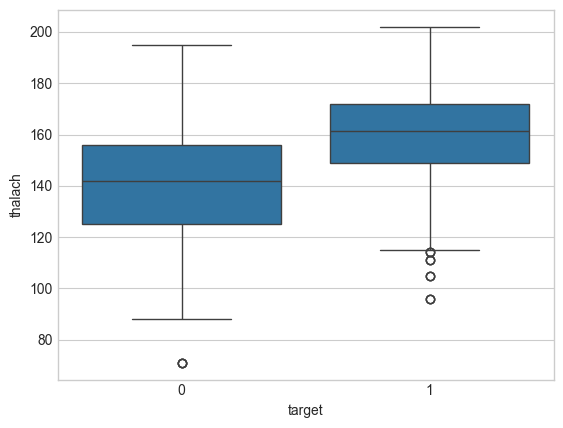
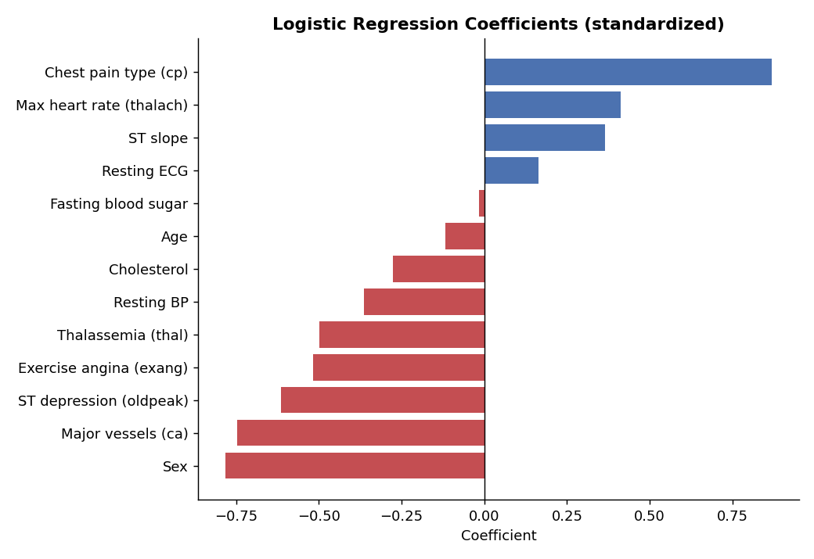

# ❤️ Heart Disease Prediction — Logistic Regression Classifier

Predicting whether a patient has heart disease from 13 clinical attributes using **Logistic Regression**, with a focus on **medically meaningful evaluation**: in disease detection, missing a sick patient is far worse than a false alarm.


<p align="center">
  
  
</p>

## 📌 Overview

The dataset contains **1,025 patient records** with 13 features: age, sex, chest pain type, resting blood pressure, cholesterol, fasting blood sugar, resting ECG, maximum heart rate, exercise-induced angina, ST depression, ST slope, number of major vessels, and thalassemia. The target is binary (0 = no heart disease, 1 = heart disease), and the classes are well balanced (526 vs 499).

## 🔄 Workflow

| Step | Stage | Details |
|------|-------|---------|
| 1 | Data inspection | 1,025 rows × 14 columns, no missing values, balanced classes |
| 2 | EDA | Target distribution, correlation heatmap, age and max heart rate by outcome |
| 3 | Split | Stratified 80/20 train-test split |
| 4 | Scaling | `StandardScaler` fit on the training set only |
| 5 | Modeling | Logistic Regression |
| 6 | Interpretation | Standardized coefficients to rank feature influence |
| 7 | Evaluation | Confusion matrix, manual metric calculation, classification report, ROC-AUC |

## 🔍 Exploratory Analysis

<table>
  <tr>
    <td></td>
    <td></td>
  </tr>
  <tr>
    <td align="center"><b>Balanced target classes</b></td>
    <td align="center"><b>Feature correlation heatmap</b></td>
  </tr>
  <tr>
    <td></td>
    <td></td>
  </tr>
  <tr>
    <td align="center"><b>Age by outcome</b></td>
    <td align="center"><b>Patients with heart disease reach higher max heart rates (~160 bpm)</b></td>
  </tr>
</table>

## 📊 Results

Evaluated on a held-out test set of 205 patients.

| Metric | Score |
|--------|-------|
| Accuracy | 0.81 |
| Precision (disease) | 0.76 |
| **Recall (disease)** | **0.91** |
| F1 (disease) | 0.83 |
| **ROC-AUC** | **0.930** |

**Confusion matrix:** 96 true positives, 70 true negatives, 30 false positives, and only **9 false negatives**.

### Why recall matters here

- A **false negative** (a sick patient predicted healthy) can delay treatment with serious consequences.
- A **false positive** (a healthy patient flagged) only leads to further tests.
- The model therefore prioritizes **recall**. It catches **91% of heart disease cases**, accepting more false alarms in exchange.
- Accuracy alone can be misleading. A model with 85% accuracy but 50% recall would miss half of all sick patients.

## 🧠 Feature Influence

<p align="center">
  
</p>

- **Chest pain type (`cp`)** is the strongest positive predictor of heart disease, followed by **max heart rate** and **ST slope**.
- **Sex**, **number of major vessels (`ca`)**, **ST depression (`oldpeak`)** and **exercise-induced angina** are the strongest negative predictors.
- Because features are standardized, coefficients are directly comparable in magnitude.

## 🚀 Getting Started

```bash
git clone https://github.com/MMujtabaX/Classification_Project.git
cd Classification_Project
pip install -r requirements.txt
jupyter notebook classification.ipynb
```

## 📁 Project Structure

```
├── assets/                  # Plots used in this README
├── heart.csv                # Dataset
├── classification.ipynb     # Full analysis notebook
├── requirements.txt
└── README.md
```

## ⚠️ Limitations & Future Work

- **Duplicate records:** this version of the dataset contains only **302 unique patients**; 723 of the 1,025 rows are exact duplicates. Duplicates can land in both train and test sets and inflate scores. After deduplication, the same model scores **~0.80 accuracy and 0.87 ROC-AUC**, which is a more realistic estimate.
- **Categorical features** like `cp`, `thal` and `slope` are treated as numeric. One-hot encoding would be more correct.
- **Threshold tuning** could push recall even higher for clinical screening.
- **Model comparison:** try Random Forest, SVM and gradient boosting, with cross-validation.

## 📚 Dataset

Heart Disease dataset (UCI Machine Learning Repository, combined Cleveland, Hungary, Switzerland and Long Beach V data).

## 👤 Author

**Muhammad Mujtaba Khan Suri** — CS @ UBIT, University of Karachi
[GitHub](https://github.com/MMujtabaX)
